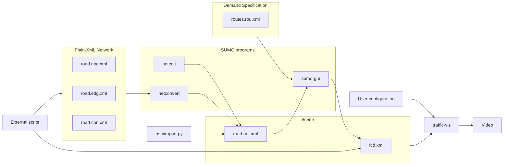

The road network is a central feature of our traffic visualizer.
In this post, I will first show how you can generate your own road networks and import networks from real-world map data. 
Next, I will explain how I managed to overcome some interesting challenges in getting a realistic looking road network from SUMO network files.

<!-- 
<!--      alt="Part of the Eindhoven road network near the university." -->
<!--      style="display: block; margin: 30px auto 0 auto; width: 100%;"> -->

## Network file format

As we saw in the [last post](), our traffic visualizer needs a *network file* and a *trajectory file*, which together define a visualization scene.
Trajectory files are expected to be in the SUMO's FCDOutput file format and will be subject to a future blog post.
We will now focus on working with road definitions in SUMO's network format.

There are two representations of SUMO road networks: the *plain-XML files* (with .nod.xml, .edg.xml and .con.xml extensions) and the *concrete network file* (with .net.xml extension).
The former are meant to be edited manually, while the latter is not, since it contains a lot of generated information. For example, it contains precise polygonal descriptions of each intersections, such that the connected lanes are connected in a smooth fashion.
To use SUMO for actual traffic simulation, so when using the sumo or the sumo-gui program, you need a concrete network file as input.
It is possible to switch between both formats without information loss using the netconvert program, which also has quite a few options to fine-tune the conversion.

We will first illustrate how to work with plain-XML files to programmatically generate your own networks, because that helps us understand the underlying structure of edges and lanes. After that, we will briefly show how to import networks from real-world map data provided by OpenStreetMap.

## Creating and editing SUMO networks

To follow along with this guide, I assume you have the latest version of SUMO. See the [downloads page](https://sumo.dlr.de/docs/Downloads.php) of the SUMO documentation for instructions on how to install it for your operating system.

Constructing networks using the [plain-XML](https://sumo.dlr.de/docs/Networks/PlainXML.html#connection_descriptions) files
allows us to procedurally generate road networks. This might be useful when we want to generate lots of artificial scenarios, for example for autonomous driving experiments.
Another situation in which this is helpful, is when you have some network in a format that is not in the [list of third-party formats](https://sumo.dlr.de/docs/Networks/Import/index.html) that already supported for importing.
When you don't want to write you own network generator, make sure to check out the [netgenerate](https://sumo.dlr.de/docs/Networks/Abstract_Network_Generation.html) program that ships with SUMO.

### Specifying the network

The underlying data structure of any SUMO network is a graph, so we start by creating a nodes file (road.nod.xml), containing IDs and coordinates of all intersections (also called junctions) in the following simple XML format:
```xml
<nodes>
    <node id="J1" x="-41.45" y="-33.26" />
    <node id="J2" x="-11.52" y="-31.32" />
    <node id="J3" x="10.58" y="-16.36" />
    <node id="J4" x="6.66" y="-63.30" />
</nodes>
```

Standard libraries of most modern programming languages contain facilities for reading, writing and formatting XML files. For example, you can use Python's `xml.etree.ElementTree` class to generate the above nodes file as follows:

```python
import xml.etree.ElementTree as ET
nodes_root = ET.Element("nodes")
ET.SubElement(nodes_root, "node", id="J1", x="-41.45", y="-33.26")
ET.SubElement(nodes_root, "node", id="J2", x="-11.52", y="-31.32")
ET.SubElement(nodes_root, "node", id="J3", x="10.58", y="-16.36")
ET.SubElement(nodes_root, "node", id="J4", x="6.66", y="-63.30")
ET.indent(nodes_root, space="  ")
ET.ElementTree(nodes_root).write("road.nod.xml")
```

We also need an edges file (road.edg.xml), describing the road segments connecting these intersections.
Each edge can have multiple lanes and has an optional width attribute.
Actually, it would be better to speak of arcs instead of edges, because they have a fixed direction. This means that we need to include two edges in opposite directions when we want to model a bidirectional road.
It is a common convention to use a minus sign prefix in the ID of an edge that is opposite to another edge.

```xml
<edges>
    <edge id="-E1" from="J2" to="J1" numLanes="2" />
    <edge id="-E2" from="J3" to="J2" numLanes="2" />
    <edge id="-E3" from="J4" to="J2" numLanes="1" />
    <edge id="E1" from="J1" to="J2" numLanes="4" />
    <edge id="E2" from="J2" to="J3" numLanes="3" />
    <edge id="E3" from="J2" to="J4" numLanes="2" shape="-11.52,-31.32 -2.40,-51.04 6.66,-63.30"/>
</edges>
```

### Edges, lanes and centerlines

Each edge has a *centerline*. By default, this is just the straight line between the *from*-node and the *to*-node. If you want to have curved roads, you can specify a custom centerline using the *shape* attribute, by giving a list of coordinates. We did this for edge "E3" in the edges file above.

Each edge can have multiple lanes (specified by "numLanes") and each lane has its own centerline as well. There are three ways, referred to as *spread types*, in which lane centerlines are determined from the edge centerline.
The behavior of the three spread types *right* (the default), *center* and *roadCenter* are illustrated in the figure below: for each edge, *from*-node and *to*-nodes are shown as little dots and each edge's centerline is drawn as a dashed line.
The above two roads consist of a unidirectional edge with 3 lanes.
The bottom two road consist of a pair of opposite edges, with 3 and 2 lanes, respectively.

The exact interpretation of each spread type is explained [here](https://sumo.dlr.de/docs/Networks/PlainXML.html#spreadtype). From my current understanding, *center* is only meant to be used with unidirectional roads, while *roadCenter* is only meant to be used with bidirectional roads. However, as you can see from the figure below, other combinations also seem to work, so there are probably some default fallbacks.


### Generating the concrete network file

Now that we have a nodes file and an edges file, we can now generate a concrete network file road.net.xml using the following command:

`netconvert --node-files=road.nod.xml --edge-files=road.edg.xml --output-file=road.net.xml`

At the risk of oversimplifying, all what this command essentially does is computing the lane centerlines and generating the shapes of the intersections such that incoming and outgoing lanes are connected smoothly.
There are various options to refine how netconvert generates these. For example, nearby intersections can be merged (`--junctions.join`), you can specify the level of detail of the polygon (`--junctions.corner-detail`), see `netconvert --help` for the full list.

To view the result, run `netedit road.net.xml` to open the netedit program. You might need to press the F5 key to refresh the precise geometry of the intersection, such that you see a little road network similar to the one you see in the screenshot below.
You can use netedit to edit the network or create networks from scratch.
See the [Hello World tutorial](https://sumo.dlr.de/docs/Tutorials/Hello_World.html) of the SUMO documentation for a quick intro.


     
### Customizing intersection connections

In the network above, notice that for some lanes, there is a little arrow at the stopline that indicates in which directions vehicles from that lane are allowed to drive.
Our visualization does not use this information, but if you are going to use the concrete road network with SUMO for traffic simulation (sumo or sumo-gui) to generate vehicle trajectories, you might want to also customize these via the *connections file* (road.con.xml), also see the corresponding  [documentation entry](https://sumo.dlr.de/docs/Networks/PlainXML.html#connection_descriptions).
If you do not specify this explicitly, netconvert will automatically make a guess based on the number of lanes per edge, which sometimes results in strange connections like the u-turns in the screenshot above.
To specify the connections file, use the `--connection-files` option of netconvert.
```xml
<connections>
  <connection from="E1" to="E2" fromLane="0" toLane="0" />
  <!-- etc. -->
</connections>
```
     
### Importing a network from OpenStreetMap

It is also possible to create a road network by importing from real-world map data.
SUMO includes a Python script [osmWebWizard.py][osmwebwizard] that presents you with a webpage (shown below) where you can select a rectangular region of the world map provided by [OpenStreetMap][openstreetmap].
You can also specify whether you also want to include cyclepaths, pedestrian roads, railroads, etc. Note that, at the time of writing, our visualization does not distinguish between these types, so every road is drawn in darkgrey.

To locate the osmWebWizard.py script, you can check the SUMO installation directory, which is typically located at `/usr/share/sumo/tools/osmWebWizard.py` on Linux systems.
It should open a web page that lets you select a region of interest on a map and then generates the corresponding concrete network file.
At the time of writing this, I am using SUMO version 1.27.0 on Ubuntu 22.04.
Make sure to update to at least this version, since this release contains a fix to an "missing attribution" issue in the OSM import process, see [this issue](https://github.com/eclipse-sumo/sumo/issues/17941)


## Drawing SUMO networks

To draw concrete road networks in our visualization app, it would have been nice if all geometric primitives were readily available, and we could just draw everything without further processing.
What is included is a polygonal description of each intersection's shape, which can get complicated for general network topologies.
Each such a polygon is stored as a list of points in the *shape* attribute of each intersections, so it can be directly rendered without any further processing.

For lanes, the situation is a little bit different. Instead of a polygon describing the outer boundaries of a lane, the *shape* attribute contains a list of points describing its centerline.
In the concrete network file, lane geometries are defined by a centerline and a width.
To draw the lanes, their centerlines can be expanded into full lane geometries using *polygon buffering*, which is the process of generating new geometric boundaries at a set distance around or within an existing polygon feature. It essentially expands outward from the original boundary, creating a larger polygon that surrounds the original feature.

### Extracting lane demarcations

While the basic lane and intersection geometries are relatively straightforward to draw, I wanted to also add lane markings to the visualization to make it more realistic.
SUMO does not provide explicit road markings such as lane separators or dashed divider lines, but these are an important part of the visual appearance of roads.
I will now briefly explain how I managed to compute these auxiliary elements from the underlying lane structure.

First of all, we compute outer boundary lines for all edges by taking the union of all lane geometries in the network, and using the boundary of the resulting polygon to draw a solid outer boundary line.
Next, the dashed lane separators between lanes in the same direction can simply be computed by taking the centerline of each lane and buffering it by half the lane width.
The more difficult part is to compute lane separators between lanes from different edges when they are very close.

Unfortunately, the line separating two opposite edges is not present in a concrete network file. Hence, we had to develop our own algorithm for reconstructing it from the lane shapes.
The algorithm tries to find the seams between lanes from different edges that almost touch.

To avoid having to check all pairs of lanes, we first build a R-tree spatial index to quickly query for nearby lanes.
For each candidate pair of touching lanes, we buffer both lanes slightly and then compute the intersections of the resulting enlarged lanes.
This intersection may consist of multiple disconnected components, which we call seams.
For each seam, we compute a centerline using the [`pygeoops.centerline()` procedure](https://pygeoops.readthedocs.io/en/stable/api/pygeoops.centerline.html).

Next, we check if the seam runs more or less parallel (possibly with opposite direction) to the original lane.
This is done by taking the tangent vector halfway along each centerline and checking whether the absolute value of the dot product between these two vectors is above some threshold.

Depending on the type of edge and lanes, we can generate a solid or dashed marker along the seam.
For example, the figure below illustrate the above procedure for two cycle lanes in opposite direction, for which a dashed marker is commonly used in the Netherlands.
This choice is currently still hardcoded; we still need to figure out a good rule to decide this based on the edge or lane types and other attributes.

<style>
.algorithm-grid {
  display: grid;
  grid-template-columns: repeat(auto-fit, minmax(250px, 1fr));
  gap: 1.5rem;
  margin: 2rem 0;
}

.algorithm-step {
  margin: 0;
}

.algorithm-step img {
  display: block;
  width: 100%;
  height: auto;
}

.algorithm-step figcaption {
  margin-top: 0.5rem;
  font-size: 0.95rem;
  line-height: 1.4;
}
</style>

<div class="algorithm-grid">

  <figure class="algorithm-step">
    
    <figcaption>
      <strong>Step 1.</strong> We start with just the road network as a set of lane polygons. We query the R-tree spatial index for each lane to find candidate nearby lanes.
    </figcaption>
  </figure>

  <figure class="algorithm-step">
    
    <figcaption>
      <strong>Step 2.</strong> To check whether a candidate lane is indeed close enough, we buffer the original lane by a small amount (shown in white).
    </figcaption>
  </figure>

  <figure class="algorithm-step">
    
    <figcaption>
      <strong>Step 3.</strong> Given some candidate touching lane from the R-tree index, we also buffer it by the same amount.
    </figcaption>
  </figure>

  <figure class="algorithm-step">
    
    <figcaption>
      <strong>Step 4.</strong> Compute the intersection of the two buffered polygons and extract the centerline from it. Also check whether the original edges ran parallel (check dot product).
    </figcaption>
  </figure>

  <figure class="algorithm-step">
    
    <figcaption>
      <strong>Step 5.</strong> Along the centerline, sample regularly spaced points and create dashed line segments to produce the final lane markings.
    </figcaption>
  </figure>

  <figure class="algorithm-step">
    
    <figcaption>
      <strong>Step 6.</strong> Apart from the touching lane markings, we also add a solid edge marking at the outer boundary of the total road network for the final look.
    </figcaption>
  </figure>

</div>

### Network viewing interface

While working on the above algorithm, I thought it would be helpful to see the intermediate steps of the algorithm, to check if it is working as intended.
At first, I thought it would be convenient to do this inside a Jupyter notebook, so I first tried using inline matplotlib plots. However, somehow the navigation was very laggy.
Then I decided to just send some additional debuggin shapes (polygons, lines) to the frontend, so that I can just use the existing visualization pipeline.
To support this idea, I added a little menu to toggle on and off different layers of the network.
Furthermore, clicking on any polygon provides information about the original ID and other attributes of the road segment from the SUMO network file, which is helpful for debugging.

Although this feature is nice, for debugging the touching lane separator algorithm I really wanted to customize the rendering, so I decided to just generate SVG images programmatically.
It was not too difficult to generate a simple HTML page containing the SVG image together with some embedded Javascript code to support "slippy map" navigation.

### General performance issues

The current implementation suffers from some performance issues for larger networks.
First of all, the preprocessing of networks starts taking a noticeable amount of time. For example, for the road network of the Eindhoven University of Technology that you see in the screenshot of the OSM importer above, it can take up to a minute of preprocessing, which is not quite acceptable.
Furthermore, the amount of vertices grows quickly when using the edge and lane demarcations.
There are some solutions that come to mind. First of all, we could implement an adaptive "level-of-detail" system, showing a rougher geometry when zoomed out. For example, only draw lane markings when zoomed in enough.
Second, it might help to implement the edge and lane demarcations using shader-based lines, instead of drawing them as actual meshes. 

## Conclusion

We briefly explained how you can use existing SUMO network tools and programmatically generate your own custom SUMO road networks for our traffic visualization tool.
We also showed that the SUMO network file format does not already contain the full geometry that is required for drawing a realistic looking road network.
Specifically, I presented a heuristic geometric algorithm to compute lane demarcations for lanes from different edges that are very close.

The diagram below contains an overview of how the different files and programs that we discussed in this post are related. In a future post, we will explain how to setup a demand specification (routes.rou.xml) and use SUMO's traffic simulator to generate vehicle trajectories (fcd.xml).



[osmwebwizard]: https://sumo.dlr.de/docs/Tutorials/OSMWebWizard.html
[openstreetmap]: https://www.openstreetmap.org/
