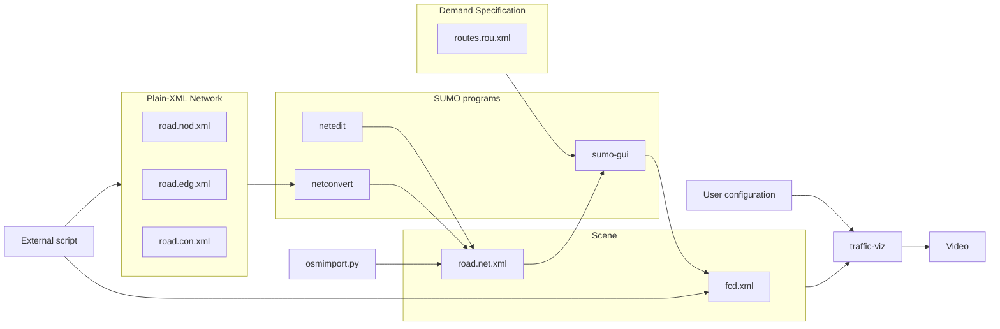

Learn how to generate and edit SUMO road networks, from simple procedural generation to importing real-world maps from OpenStreetMap. We also discuss some geometric challenges involved in turning SUMO network files into realistic 3D road visualizations.



## Network file format

As explained in [this previous post](), the traffic visualizer needs a *network file* and a *trajectory file*, which together define a visualization scene.
The trajectory file is expected to be in SUMO's FCDOutput file format, which is essentially a list of time-position entries in a simple XML format.
The network file is slightly more complex, so we will use this post to explain how to generate and edit such files, as well as touch upon some challenges involving the actual network drawing procedure.

There are two representations of SUMO road networks: the *plain-XML files* (with .nod.xml, .edg.xml and .con.xml extensions) and the *concrete network file* (with .net.xml extension).
The former are meant to be edited manually, while the latter is not, since it contains a lot of generated information. For example, it contains precise polygonal descriptions of each intersection, such that lanes are connected in a smooth fashion.
To use SUMO for actual traffic simulation—so when directly invoking sumo via the command line or when using the sumo-gui program—you need a concrete network file as input.
It is possible to switch between both formats without information loss using the netconvert program, which also has quite a few options to fine-tune the conversion.

The diagram at the top of this post provides an overview of how some of the files and programs that we will discuss are related.
<!-- In a future post, we will explain how to setup a demand specification (routes.rou.xml) and use SUMO's traffic simulator to generate vehicle trajectories (fcd.xml). -->
We will first illustrate how to work with plain-XML files to programmatically generate your own networks, because that helps us understand the underlying structure of edges and lanes. After that, we will briefly show how to import networks from real-world map data provided by OpenStreetMap.

## Creating and editing SUMO networks

To follow along with this guide, I assume you have the latest version of SUMO installed. See the [downloads page](https://sumo.dlr.de/docs/Downloads.php) of the SUMO documentation for detailed installation instructions.

Constructing networks using the [plain-XML](https://sumo.dlr.de/docs/Networks/PlainXML.html#connection_descriptions) files
allows us to procedurally generate road networks. This might be useful when we want to generate lots of artificial scenarios, for example for autonomous driving experiments.
Another situation in which this is helpful, is when you have a network in a format that is not in the [list of third-party formats](https://sumo.dlr.de/docs/Networks/Import/index.html) that are already supported for importing.
When you don't want to write your own network generator, make sure to check out the [netgenerate](https://sumo.dlr.de/docs/Networks/Abstract_Network_Generation.html) program that ships with SUMO.

### Manually specifying the road network

The underlying data structure of any SUMO network is a graph, so we start by creating a node file (road.nod.xml), containing IDs and coordinates of all intersections (also called junctions) in the following simple XML format:
```xml
<nodes>
    <node id="J1" x="-41.45" y="-33.26" />
    <node id="J2" x="-11.52" y="-31.32" />
    <node id="J3" x="10.58" y="-16.36" />
    <node id="J4" x="6.66" y="-63.30" />
</nodes>
```

Standard libraries of most modern programming languages contain facilities for reading, writing and formatting XML files. For example, you can use Python's `xml.etree.ElementTree` class to generate the above node file as follows:

```python
import xml.etree.ElementTree as ET
nodes_root = ET.Element("nodes")
ET.SubElement(nodes_root, "node", id="J1", x="-41.45", y="-33.26")
ET.SubElement(nodes_root, "node", id="J2", x="-11.52", y="-31.32")
ET.SubElement(nodes_root, "node", id="J3", x="10.58", y="-16.36")
ET.SubElement(nodes_root, "node", id="J4", x="6.66", y="-63.30")
ET.indent(nodes_root, space="  ")
ET.ElementTree(nodes_root).write("road.nod.xml")
```

We also need an edge file (road.edg.xml), describing the road segments connecting these intersections.
Each edge can have multiple lanes and has an optional width attribute.
Strictly speaking, these are directed arcs rather than edges, because they have a fixed direction. This means that we need to include two edges in opposite directions when we want to model a bidirectional road.
It is a common convention to use a minus sign prefix in the ID of an edge that is opposite to another edge.
An example of a valid edge file is:

```xml
<edges>
    <edge id="-E1" from="J2" to="J1" numLanes="2" />
    <edge id="-E2" from="J3" to="J2" numLanes="2" />
    <edge id="-E3" from="J4" to="J2" numLanes="1" />
    <edge id="E1" from="J1" to="J2" numLanes="4" />
    <edge id="E2" from="J2" to="J3" numLanes="3" />
    <edge id="E3" from="J2" to="J4" numLanes="2" shape="-11.52,-31.32 -2.40,-51.04 6.66,-63.30"/>
</edges>
```

### Edges, lanes and centerlines

Each edge has a *centerline*. By default, this is just the straight line between the *from*-node and the *to*-node. If you want to have curved roads, you can specify a custom centerline using the *shape* attribute, by giving a list of coordinates. We did this for edge "E3" in the example above.

Each edge can have multiple lanes (specified by "numLanes") and each lane has its own centerline as well. There are three ways, referred to as *spread types*, in which lane centerlines are determined from the edge centerline.
The behavior of the three spread types—*right* (the default), *center* and *roadCenter*—is illustrated in the figure below: for each edge, *from*-node and *to*-nodes are shown as little dots and each edge's centerline is drawn as a dashed line.
The above two roads consist of a unidirectional edge with 3 lanes.
The bottom two roads consist of a pair of opposite edges, with 3 and 2 lanes, respectively.

The exact interpretation of each spread type is explained [here](https://sumo.dlr.de/docs/Networks/PlainXML.html#spreadtype). From my current understanding, *center* is only meant to be used with unidirectional roads, while *roadCenter* is only meant to be used with bidirectional roads. However, as you can see from the figure below, other combinations appear to work as well, so SUMO probably uses some default fallbacks.

  <figure>
    
    <figcaption>
      <strong>Illustration of the spreadType property.</strong> The code for generating this figure can be found in <a href="https://github.com/jeroenvanriel/traffic-viz/blob/main/backend/demo/sumo-spread-type.ipynb">this notebook</a>.
    </figcaption>
  </figure>

### Generating the concrete network file

Now that we have a node file and an edge file, we can generate a concrete network file road.net.xml using the following command:

`netconvert --node-files=road.nod.xml --edge-files=road.edg.xml --output-file=road.net.xml`

What this command essentially does is compute the lane centerlines and generating the shapes of the intersections such that incoming and outgoing lanes are connected smoothly.
There are various options to further refine how netconvert generates these shapes. For example, nearby intersections can be merged (`--junctions.join`), you can specify the level of detail of the polygon (`--junctions.corner-detail`), see `netconvert --help` for the full list.

To view the result, run `netedit road.net.xml` to open the netedit program. You might need to press the F5 key to refresh the precise geometry of the intersection. You should see a small road network similar to the one in the screenshot below.
As the name suggests, you can use netedit to edit the network or create networks from scratch.
See the [Hello World tutorial](https://sumo.dlr.de/docs/Tutorials/Hello_World.html) of the SUMO documentation for a quick intro.


     
### Customizing the connections within intersections

In the network above, notice that for some lanes, there is a little arrow at the stop line that indicates in which directions vehicles from that lane are allowed to drive.
Our visualization does not use this information, but if you are going to use the concrete road network with SUMO for traffic simulation (sumo or sumo-gui) to generate vehicle trajectories, you might want to also customize these via the *connections file* (road.con.xml), also see the corresponding  [documentation entry](https://sumo.dlr.de/docs/Networks/PlainXML.html#connection_descriptions).
If you do not specify this explicitly, netconvert will automatically make a guess based on the number of lanes per edge, which sometimes results in strange connections like the u-turns in the screenshot above (see the left-most lane of the 4-lane edge).
To specify the connections file, use the `--connection-files` option when calling netconvert from the command line.
```xml
<connections>
  <connection from="E1" to="E2" fromLane="0" toLane="0" />
  <!-- etc. -->
</connections>
```
     
### Importing a network from OpenStreetMap

It is also possible to create a road network by importing from real-world map data.
SUMO includes a Python script [osmWebWizard.py][osmwebwizard] that presents you a webpage (shown below) where you can select a rectangular region of the world map provided by [OpenStreetMap][openstreetmap].
You can also specify whether you also want to include cycle paths, pedestrian roads, railroads, etc. Note that, at the time of writing, our visualization does not distinguish between these types, so every road is drawn in the same style.

To locate the osmWebWizard.py script, you can check the SUMO installation directory, which is typically located at `/usr/share/sumo/tools/osmWebWizard.py` on Linux systems.
It should open a web page that lets you select a region of interest on a map and then generates the corresponding concrete network file.
At the time of writing this, I am using SUMO version 1.27.0 on Ubuntu 22.04.
Make sure to update to at least this version, since this release contains a fix to a "missing attribution" issue in the OSM import process, see [this issue](https://github.com/eclipse-sumo/sumo/issues/17941)


## Challenges in drawing SUMO networks

I will now discuss some of the technical challenges that I faced while developing a robust drawing procedure for SUMO road networks.

It would have been nice if all geometric primitives were readily available in the concrete network file, and we could just draw polygons and lines without further processing. Unfortunately, this is not the case.
What is included is a polygonal description of each intersection's shape, which can get complicated for general network topologies.
Each such polygon is stored as a list of points in the *shape* attribute of each intersection, so it can be directly rendered without any further processing. See figure *Step 1* below.

For lanes, the situation is a little bit different. Instead of a polygon describing the outer boundaries of a lane, the *shape* attribute contains a list of points describing its centerline, see *Step 2*.
In the concrete network file, lane geometries are defined by a centerline and a width.
To draw the lanes, their centerlines can be expanded into full lane geometries using *polygon buffering*, which is the process of generating new boundaries at a set distance around or within an existing polygon feature. It expands outward from the original boundary, creating a larger polygon that surrounds the original feature, as shown in *Step 3*.

<style>
.algorithm-grid {
  display: grid;
  grid-template-columns: repeat(auto-fit, minmax(250px, 1fr));
  gap: 1.5rem;
  margin: 2rem 0;
}

.algorithm-step {
  margin: 0;
}

.algorithm-step img {
  display: block;
  width: 100%;
  height: auto;
}

.algorithm-step figcaption {
  margin-top: 0.5rem;
  font-size: 0.95rem;
  line-height: 1.4;
}
</style>


<div class="algorithm-grid">

  <figure class="algorithm-step">
    
    <figcaption>
      <strong>Step 1.</strong> Drawing the intersections, which are readily available as polygons in the "shape" attribute.
    </figcaption>
  </figure>

  <figure class="algorithm-step">
    
    <figcaption>
      <strong>Step 2.</strong> The black lines between the intersections represent the lane centerlines.
    </figcaption>
  </figure>

  <figure class="algorithm-step">
    
    <figcaption>
      <strong>Step 3.</strong> The lanes are drawn by applying "polygon buffering" on the centerlines.
    </figcaption>
  </figure>
  
</div>

### Computing road markings

Road markings such as lane separators or dashed divider lines are an important aspect of the visual appearance of roads.
These kinds of lines are not explicitly provided by SUMO networks, but we can use some further geometric processing to derive them.

First, we want to have a solid outer boundary line for all the intersections and edges taken as a whole, which vehicles are never supposed to cross.
To compute this line, we simply compute the union of all intersections and lane polygons as seen in *Step 3*. 
We then use the outer boundary and the holes of the resulting polygon to draw a solid line, resulting in *Step 4*.

We also want to draw dashed lines between lanes that belong to the same edge (so having the same direction of travel).
This can simply be done by taking the centerline of each lane and then offsetting it by half the lane width, for example to the left, while skipping the leftmost lane. See *Step 5* for the resulting look.

For bidirectional roads, it is common to see a line separating the middle two lanes of the corresponding edges, running in opposite directions.
In the Netherlands, this line is solid or dashed depending on whether vehicles are allowed to overtake using the opposite lane.
We refer to this type of line as the *separating centerline*. In some cases (depending on the *spread type*) it is the same line as the *edge centerline* discussed above, but note that the latter is not available when we only have a concrete network file.
Hence, we will briefly explain a simple heuristic to construct it from the available geometry. The final look is shown in *Step 6*.

<div class="algorithm-grid">

  <figure class="algorithm-step">
    
    <figcaption>
      <strong>Step 4.</strong> Outer edge marking, based on the union of all intersection and lane polygons.
    </figcaption>
  </figure>

  <figure class="algorithm-step">
    
    <figcaption>
      <strong>Step 5.</strong> Adding dashed lines to separate all the lanes that belong to the same edge.
    </figcaption>
  </figure>

  <figure class="algorithm-step">
    
    <figcaption>
      <strong>Step 6.</strong> Solid separating centerlines, shown in yellow, computed using our heuristic algorithm.
    </figcaption>
  </figure>

</div>

### Separating centerline algorithm

First, we try to find the seams between lanes from different edges that almost touch.
To avoid having to check all pairs of lanes, we build an R-tree spatial index to quickly query for nearby lanes.
For each candidate pair of touching lanes, we buffer both lanes slightly and then compute the intersections of the resulting enlarged lanes.
This intersection may consist of multiple disconnected components, which we call seams.
For each seam, we compute a centerline using the [`pygeoops.centerline()` procedure](https://pygeoops.readthedocs.io/en/stable/api/pygeoops.centerline.html).

Next, we check if the seam runs approximately parallel to the original lane.
This is done by taking the tangent vector halfway along each centerline and checking whether the absolute value of the dot product between these two vectors is above some threshold.

Depending on the type of edge and lanes, we can generate a solid or dashed marker along the seam.
For example, the figures below illustrate the procedure for two cycle lanes in opposite directions, for which a dashed line marker is commonly used in the Netherlands.
This choice is currently hardcoded; we might need to figure out a good rule to decide this based on the edge or lane types and other attributes.

<div class="algorithm-grid">

  <figure class="algorithm-step">
    
    <figcaption>
      <strong>Step 6a.</strong> We start with just the road network as a set of lane polygons. We query the R-tree spatial index for each lane to find candidate nearby lanes.
    </figcaption>
  </figure>

  <figure class="algorithm-step">
    
    <figcaption>
      <strong>Step 6b.</strong> To check whether a candidate lane is indeed close enough, we buffer the original lane by a small amount (shown in white).
    </figcaption>
  </figure>

  <figure class="algorithm-step">
    
    <figcaption>
      <strong>Step 6c.</strong> Given some candidate touching lane from the R-tree index, we also buffer it by the same amount.
    </figcaption>
  </figure>

  <figure class="algorithm-step">
    
    <figcaption>
      <strong>Step 6d.</strong> Compute the intersection of the two buffered polygons and extract the centerline from it. Also check whether the original edges run parallel (check dot product).
    </figcaption>
  </figure>

  <figure class="algorithm-step">
    
    <figcaption>
      <strong>Step 6e.</strong> Along the centerline, sample regularly spaced points and create dashed line segments to produce the final lane markings.
    </figcaption>
  </figure>

  <figure class="algorithm-step">
    
    <figcaption>
      <strong>Step 6f.</strong> Final look for this little part of the network. I am using yellow just for emphasis; this kind of line would be white in the Netherlands.
    </figcaption>
  </figure>

</div>

### Network viewing interface for development

While working on the above demarcation extraction algorithm, I wanted to see the intermediate steps to check if it is working as intended. I tried two different approaches.

At first, I thought it would be convenient to do this inside a Jupyter notebook, so I first tried using inline matplotlib plots. However, somehow the navigation was very laggy.
Then I decided to just send some additional debugging shapes (polygons, lines) to the frontend, so that I can just use the existing visualization pipeline.
To support this idea, I added a little menu to toggle different layers of the network on and off.
Furthermore, clicking on any polygon provides information about the original ID and other attributes of the road segment from the SUMO network file, which is helpful for debugging.

Although these new features are nice, I really required some deeper customization of the rendering for debugging the touching lane separator algorithm. Eventually, I decided to just generate SVG images programmatically and then view these in a browser.
It was not too difficult to generate a simple HTML page containing the SVG image together with some JavaScript code to support some minimal "slippy map" navigation.

### Performance issues with larger networks

The current implementation suffers from some performance issues when network size increases:

- *Preprocessing*. For larger networks, preprocessing starts taking a noticeable amount of time. For example, for the road network of the Eindhoven University of Technology that you see in the screenshot of the OpenStreetMap importer above, it can take up to a minute of preprocessing, which is not quite acceptable.

- *Scene complexity*. The amount of vertices in the 3D scene grows quickly when using the edge and lane demarcations.
There are some solutions that come to mind. First of all, we could implement an adaptive "level-of-detail" system, showing a less-detailed geometry when zoomed out. For example, only draw lane markings when zoomed in enough.
Second, it might help to implement the edge and lane demarcations using shader-based lines, instead of drawing them as actual meshes. 

## Conclusion

We have seen how SUMO's network tools can be used to both generate synthetic road networks and import real-world road maps. Although the resulting .net.xml files already contain much of the information required for visualization, producing a realistic rendering still requires a significant amount of additional geometric processing. By deriving lane polygons, road markings, and separating centerlines from the available network geometry, we can reconstruct a much richer representation than is explicitly stored in the original network.

The current implementation still has room for improvement. In particular, the heuristic used to identify separating centerlines could be made more robust, and preprocessing large networks remains relatively expensive. These challenges also raise an interesting question: should some of these geometric constructions become part of SUMO itself, rather than being reimplemented by downstream visualization tools?

[osmwebwizard]: https://sumo.dlr.de/docs/Tutorials/OSMWebWizard.html
[openstreetmap]: https://www.openstreetmap.org/

